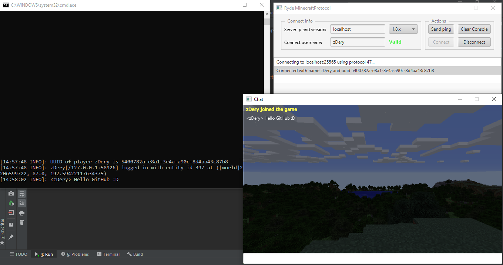

  

This is a "minilauncher" for minecraft Java Edition.

This not render chunks, only chat and other things smaller, like scoreboard.

<strong>ATTENTION:</strong> this project was not designed to be used by ordinary users. 
Its purpose is to help developers test plugins for minecraft servers.
So, when you need to test plugins that require more than one client and that don’t necessarily need chunks rendering, this project is a good option.

## What you can do with it?
For now, the only things that you can do are:
- Send ping
- Connect / disconnect
- Send and receive chat messages

Yes, I plan to add support for more things.

## Implemented versions
- [X] 1.8 (protocol 47) (not complete)
- [ ] 1.9 protocol 107)
- [ ] 1.9.1 protocol 108)
- [ ] 1.9.2 protocol 109)
- [ ] 1.9.x protocol 110)
- [ ] 1.10.x protocol 210)
- [ ] 1.11 protocol 315)
- [ ] 1.11.x protocol 316)
- [ ] 1.12 protocol 335)
- [ ] 1.12.1 protocol 338)
- [ ] 1.12.2 protocol 340)
- [ ] 1.13 protocol 393)
- [ ] 1.13.1 protocol 401)
- [ ] 1.13.2 protocol 404)
- [ ] 1.14 protocol 477)
- [ ] 1.14.1 protocol 480)
- [ ] 1.14.2 protocol 485)
- [ ] 1.14.3 protocol 490)
- [ ] 1.14.4 protocol 498)
- [ ] 1.15 protocol 573)
- [ ] 1.15.1 protocol 575)
- [ ] 1.15.2 protocol 578)
- [ ] 1.16 protocol 735)
- [ ] 1.16.1 protocol 736)
- [ ] 1.16.2 protocol 751)
- [ ] 1.16.3 protocol 753)

# Implemented packets
- [X] Set Compression (CLIENT BOUND)
- [X] Keep Alive (CLIENT and SERVER BOUND)
- [X] Chat Message (CLIENT and SERVER BOUND)
- [X] Login (SERVER BOUND)
- [X] Disconnect (CLIENT and "SERVER" BOUND)
- [X] Join Game (CLIENT BOUND)

## TODO
- [ ] Movements support
- [ ] Scoreboard support
- [ ] Attack support
- [ ] Add authenticated support
- [ ] Other things that I perhaps forgotten
- [ ] Greatly improve the code

## Thanks
Thanks to [wiki.vg](https://wiki.vg/Protocol) and [#mcdevs](ircs://chat.freenode.net:6697/mcdevs) for their incredible protocol documentation!